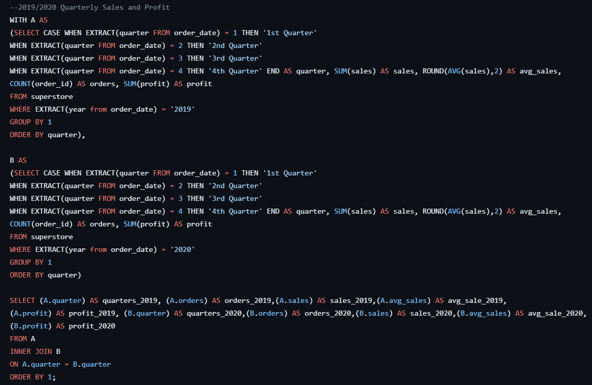
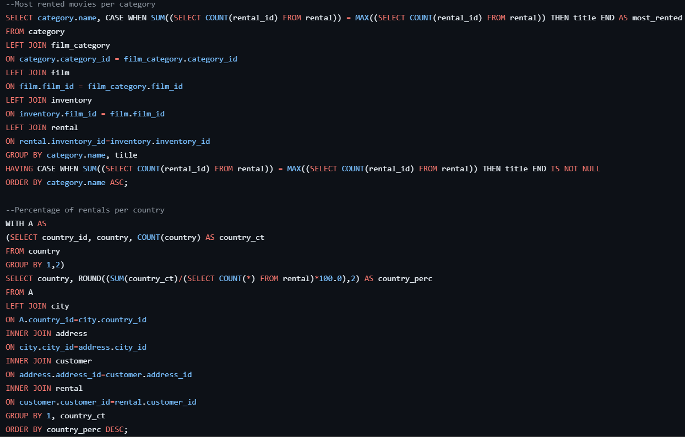

### Here I present some snippets of various projects I've worked on.

Here is a sample of some SQL I did when querying a SuperStore data set:

Checkout the the full repository here: [Superstore Portfolio Project](https://github.com/jdjustus94/SuperstorePortfolioProject/blob/main/Superstore_Portfolio_Project.sql)

Another Sample of some SQL code for a Video Rental Store Project:

Check out the full repository here: [Video Rental Store](https://github.com/jdjustus94/Video-Store/blob/main/video_rental_store.sql)

Last, and I've saved the best for it, is an interactive dashboard from a project I worked on. This dashboard utilizes hypothetical data from Sprocket Central provided by KPMG AU. The different visualizations are interactable and the drop down menus are functional. Feel free to play around and checkout the viz!

### Checkout the dashboard here: [Sprocket Central Dashboard](https://jdjustus94.github.io/Sprocket-Central-Customer-Spending-Breakdown/)

##### Check out my [LinkedIn](https://www.linkedin.com/in/joshua-justus/) for more information.

##### Head [Home](./README.md)
